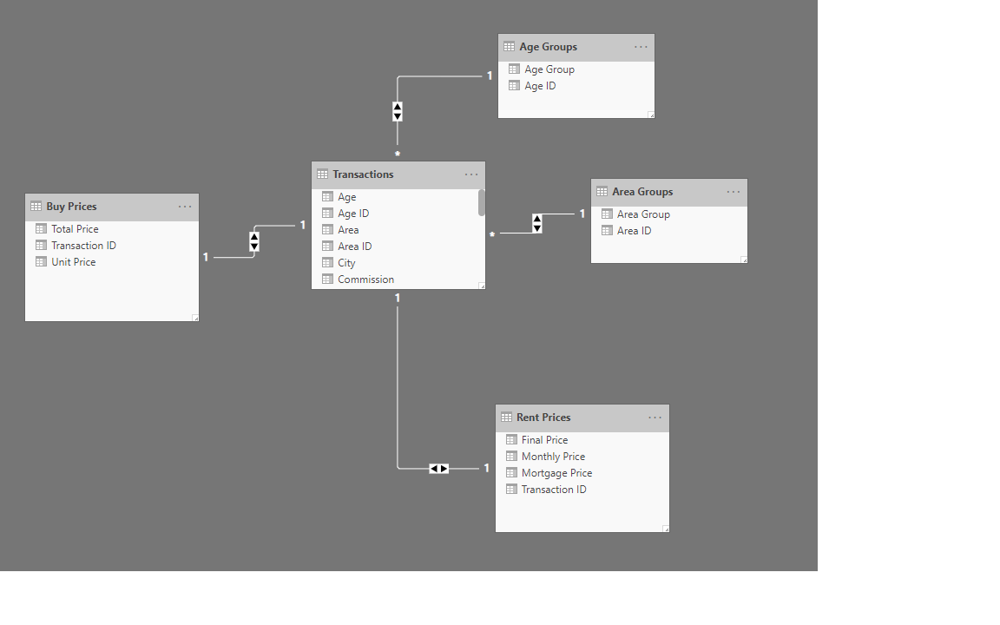

# Metraj Real Estates

This is a test visualization project for [Metraj.ir](http://www.metraj.ir). ETL is simplified by limiting data sources to flat files and reduced size of data (as per test requirements provided). Subject area are rental and buy transactions over a 4 year period.

Final result is provided as a PowerBI report file `Metraj.pbix` in `Files` directory.

Caution: You need Microsoft PowerBI desktop version installed on your computer to open `.pbix` files. You can Download & Install the executable from [HERE](https://www.microsoft.com/en-us/download/details.aspx?id=45331)

## Data Sources

Data sources can be found in `Data/Interview Project` folder. Import them as UTF-8 comma delimited flat files.


## Data Processing

ETL is quite straightforward except for handling mistyped formats for transaction dates. `13-9-2015` format had to be splited by `-` and reconcated as `YYYY-MM-DD` format

```csharp
    # split dates into its date parts
    "Split Column by Delimiter" = Table.SplitColumn(#"Replaced Value1", 
    "Transaction Date", Splitter.SplitTextByDelimiter("-", QuoteStyle.Csv), {"Day", "Month Number", "Year"}),
    # type conversion of parts into number
    "Change Date Parts Type" = Table.TransformColumnTypes(#"Split Column by Delimiter",{{"Day", Int64.Type}, {"Month Number", Int64.Type}, {"Year", Int64.Type}}),
    # reconcatenae dateparts in YYYY-MM-DD format
    "Added Transaction Date" = Table.AddColumn(#"Change Date Parts Type", "Transaction Date", each #date([Year],[Month Number],[Day])),
    # Add English Months column
    "Added Month" = Table.AddColumn(#"Added Transaction Date", "Month", each Date.MonthName([Transaction Date])),
```


## PowerBI Data Model

Data model is simple star schmea, with helper dimensions added for Area & Age segments.



## Commissions Standard

There is no direct Sales data provied in source files, but it can be easily calculated based on common standards in Iran for Real Estate rental/buying commissions. A thorough guide can be found [HERE](https://kilid.com/blog/advise/1163)

Below is the business logic for Commisisons written in DAX

```csharp

Commission = 2 * IF([Transaction Type] = "Buy", IF(RELATED('Buy Prices'[Total Price]) <= 500000000,RELATED('Buy Prices'[Total Price]) * 0.005,2500000 + (RELATED('Buy Prices'[Total Price]) - 500000000) * 0.0025),RELATED('Rent Prices'[Final Price]) * 0.25)

```

## Segmentation

Building Area and Age subjects can be segmented based on data spread and Market rules (this is valid for Age segmentation). Calculating the quartiles for Area and Age resulted in these numbers

Area

1. Q1 = 57 
2. Q2 = 70
3. Q3 = 100.8

Age

1. Q1 = 2
2. Q2 = 7
3. Q3 = 13

Building Age affects the Rental/Buy price. According to [this article](http://www.khooneyabi.ir/2018/05/04/%D9%86%D8%AD%D9%88%D9%87-%D8%A7%D8%B1%D8%B2%DB%8C%D8%A7%D8%A8%DB%8C-%D9%88-%D9%82%DB%8C%D9%85%D8%AA-%DA%AF%D8%B0%D8%A7%D8%B1%DB%8C-%D8%A2%D9%BE%D8%A7%D8%B1%D8%AA%D9%85%D8%A7%D9%86-%DA%86%D9%86%D8%AF/)

Mitigated Quartiles are as following

Area
1. Q1 = 50
2. Q2 = 70
3. Q3 = 100

Age

1. Q1 = 2
2. Q2 = 7
3. Q3 = 15


## Visualization

Visualization is provided as an Overview report of overal Sales, Segments and City shares.


## Further Steps

This Dashboard can be further enriched in information by adding separate pages for City Analysis, Age and Area categories and Map data (a bit of hassle with data, as there is a need for translation of district names and extracting their cooridnations)
